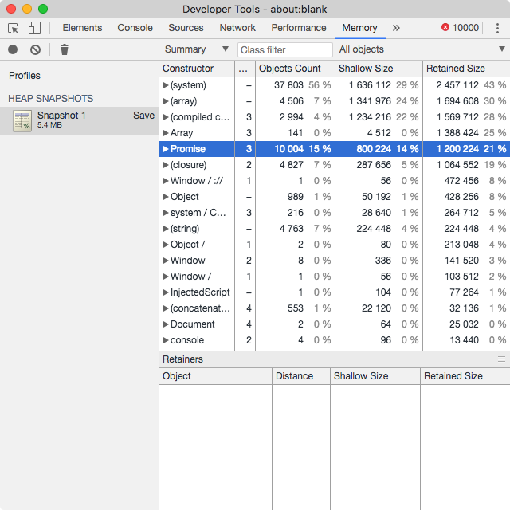

[axios](https:/github.com/axios/axios) 是一个由尤雨溪大佬推荐的 HTTP 请求库。它支持用统一的接口同时在 Node.js 和浏览器中发送请求。目前 github 上有 38K 的赞了。

以前从来没思考过他的内部实现。从我这个 API Caller 的视角来看：哦，推荐？好吧那就用吧！然而，在这个库里面还是藏着许多不一样的小秘密的。所以是时候探索一下它为什么能得到尤大的推荐了。

<!-- more -->

## 第一印象

展开目录树，没想到源码有这么多= = 从来没想过发个 HTTP 请求那么麻烦！但如果随意点开几个文件会发现，每个文件都很短。大致浏览后可以很容易可以找到源码在 `lib` 文件夹中，入口点是 `axios.js`。

## 模块划分

根据 `lib` 文件夹中的子文件夹和文件，我把 axios 分为下面的 6 块：

* `axios`：暴露 axios API，`axios.create` 的实现
* `core`：处理一个请求的整体流程（解析配置、Interceptor、发出请求、处理响应和异常处理）
* `adapters`：与底层 API 的对接（Node.js 的 http 模块，或是 `XMLHttpRequest`）
* `cancel`：负责处理“中断请求”相关事务
* `helpers` 和 `utils`：各种辅助函数
* `defaults`：储存默认参数

各个模块关系如下：

```
+-----------------------------+ +-----------+
|           axios             | |           |
+-----------------------------+ |           |
                                |           |
+----------+ +-----+ +--------+ |  helpers  |
|   core   | |     | |        | |           |
+----------+ |     | |        | |   utils   |
             | def | | cancel | |           |
+----------+ |     | |        | |           |
| adapters | |     | |        | |           |
+----------+ +-----+ +--------+ +-----------+
```

下面挑一些我认为比较特别的地方说一说。

## Interceptor

axios 中很重要的一个功能是 Interceptor。它可以让用户在请求之前对请求参数进行修改，或是在响应之后处理返回内容。通过它可以很方便地实现例如自动添加鉴权 token、封包拆包数据、异常预处理等功能。**而且它还支持 Promise**。这是我最喜欢的一个功能。

```javascript
axios.interceptors.request.use(config => {
  // 自动添加鉴权 token
  config.headers['Authorization'] = `Bearer ${somewhere.token}`
  return config;
})

axios.interceptors.response.use(response => {
  // 假设响应内容 { code: 0, data: any } | { code: number, message: string }
  // 通过下面的代码就可以拆开请求数据，后续代码可以直接从 data 中获取到响应内容
  if (response.data.code === 0) {
    response.originalData = response.data
    response.data = response.data.data
  }

  return response
})
```

**它的实现让我感觉非常惊艳**。以至于在我看完代码之后，想了好一会儿都没想到更简单的实现（也有可能是我太菜）。

<blockquote class="blockquote-center">使用 Promise 链可以很容易地实现执行一连串的异步任务。Ajax 本身可以就是一个异步任务。既然我要让用户用 Interceptor，那其实就是在请求之前和之后执行一些任务嘛，直接用 Promise 链就好啦，还可以顺便支持异步的 Interceptor 呢，多好啊！
—— axios 作者《我没说过》</blockquote>

axios 实现 Interceptor 的方法实在是简洁啊！我们来看看它的核心代码：

```javascript lib/core/Axios.js https://github.com/axios/axios/blob/9a6abd789f91a87d701116c0d86f1cfbc3295d66/lib/core/Axios.js#L39 source
var chain = [dispatchRequest, undefined];
var promise = Promise.resolve(config);

this.interceptors.request.forEach(function unshiftRequestInterceptors(interceptor) {
  chain.unshift(interceptor.fulfilled, interceptor.rejected);
});

this.interceptors.response.forEach(function pushResponseInterceptors(interceptor) {
  chain.push(interceptor.fulfilled, interceptor.rejected);
});

while (chain.length) {
  promise = promise.then(chain.shift(), chain.shift());
}
```

我们将它的代码稍微改写一下，可以看得更清楚：

```javascript lib/core/Axios.js
var promise = Promise.resolve(config);

this.interceptors.request.forEach(function unshiftRequestInterceptors(interceptor) {
  promise = promise.then(interceptor.fulfilled, interceptor.rejected);
});

promise = promise.then(dispatchRequest);

this.interceptors.response.forEach(function pushResponseInterceptors(interceptor) {
  promise = promise.then(interceptor.fulfilled, interceptor.rejected);
});
```

初始的 `promise` 是一个 resolve 了 `config` 的 Promise，然后不断地使用 `.then` 注册这个 Promise 的下一步操作。先注册请求 Interceptor，然后执行 `dispatchRequest`，最后执行响应 Interceptor。**一个 Promise 链就解决了所有问题！**

再看注册 Interceptor 的代码：

```javascript lib/core/InterceptorManager.js https://github.com/axios/axios/blob/9a6abd789f91a87d701116c0d86f1cfbc3295d66/lib/core/InterceptorManager.js#L17 source
InterceptorManager.prototype.use = function use(fulfilled, rejected) {
  this.handlers.push({
    fulfilled: fulfilled,
    rejected: rejected
  });
  return this.handlers.length - 1;
};
```

至此我们“扒开”了 Interceptor 的真面目：Interceptor 只是把 `Promise.then` 的参数先暂存一下，等到用户实际调用的时候再串在一起。这也是在 Interceptor 中必须返回 `config` 或是 `response` 的最根本原因。

我认为可以稍微改进一下 Interceptor，在它不返回任何值的时候，就返回第一个参数的内容。这样用户在 Interceptor 中没有返回值的时候（用 TypeScript 表示就是 `void | Promise<void>`），也能正常发起请求。实际上大部分使用 Interceptor 的时候都是简单地修改 `config` 或者 `response` 中的几个属性的，并不会对其进行替换。算是一个小细节修改吧。

```javascript lib/core/InterceptorManager.js
function wrap (fn) {
  if (typeof fn !== 'function') return;
  return function wrappedThenOrCatch(x) {
    var result = fn(x);
    if (result === undefined) return x;
    else if (typeof result.then === 'function') return result.then(y => y === undefined ? x : y);
    else return result;
  };
}

InterceptorManager.prototype.use = function use(fulfilled, rejected) {
  this.handlers.push({
    fulfilled: wrap(fulfilled),
    rejected: wrap(rejected)
  });
  return this.handlers.length - 1;
};
```

## Adapter 架构

另一个我认为 axios 设计的很巧妙的地方在于它的 adapter 架构。看图说话：

```
+----------------------+
|         User         |
+----------------------+
           ↓
+----------------------+
|      axios API       |
+----------------------+
           ↓
+----------------------+
|       adapter        |
+----------------------+
           ↓
+----------------------+
|        Server        |
+----------------------+

```

从这个简陋的流程图中可以看出，用户调用的接口是不变的，而具体请求的发送是由内部的 adapter 去做。所以从理论上 axios **可以在任意平台上使用**。通过它的统一 API，axios 可以同时在浏览器和 Node.js 上，使用同一套代码，得到相同的结果（如果配置得当）。我想这也是 Vue 作者推荐在 Vue 项目中使用 axios 的原因之一，因为用户在使用 Server Side Rendering 时就不用担心 Node.js 不支持 `XMLHttpRequest` 了。

另外，通过这一套架构设计，**我们可以把 axios 移植到任意平台上**，例如微信小程序等。实际上我已经有尝试移植过了：[wepy-plugin-axios](https://github.com/hjkcai/wepy-plugin-axios)。目前此项目已经获得了 40 多个 Star。目前这个移植只能用在 [wepy](https://github.com/Tencent/wepy) 上，到时候有时间再重新移植一下，让任意小程序都能使用。

至于 adapter 内具体的代码就不分析了，都是调用系统底层 API 实现的，有兴趣可以直接去看看。

## 中断请求

请求后返回 Promise 的一个弊端就在于**没办法取消请求**。虽然实际上取消请求的场景不多（我猜的），但还是有可能有这样的场景的。axios 实现了 TC39 的一个 [Cancelable Promise](https://github.com/tc39/proposal-cancelable-promises/tree/0e769fda8e16bff0feffe964fddc43dcd86668ba) 提案。该提案目前已经被撤回，而我认为 axios 的实现也不够完美（[虽然作者也说先随便弄一下](https://github.com/axios/axios/issues/333#issuecomment-240506469)）。

官方的取消请求例子是这样的：

```javascript
var CancelToken = axios.CancelToken;
var source = CancelToken.source();

axios.get('/user/12345', {
  cancelToken: source.token
}).catch(function(thrown) {
  if (axios.isCancel(thrown)) {
    console.log('Request canceled', thrown.message);
  } else {
    // handle error
  }
});

// cancel the request (the message parameter is optional)
source.cancel('Operation canceled by the user.');
```

`CancelToken.source` 的实现：

```javascript lib/cancel/CancelToken.js https://github.com/axios/axios/blob/master/lib/cancel/CancelToken.js#L46 source
CancelToken.source = function source() {
  var cancel;
  var token = new CancelToken(function executor(c) {
    cancel = c;
  });
  return {
    token: token,
    cancel: cancel
  };
};
```

`CancelToken` 构造函数：

```javascript lib/cancel/CancelToken.js https://github.com/axios/axios/blob/master/lib/cancel/CancelToken.js#L11 source
function CancelToken(executor) {
  if (typeof executor !== 'function') {
    throw new TypeError('executor must be a function.');
  }

  var resolvePromise;
  this.promise = new Promise(function promiseExecutor(resolve) {
    resolvePromise = resolve;
  });

  // ... 此处省略
}
```

发现什么了没有！！**在大量请求含有通过 `CancelToken.source` 创建的 `CancelToken` 时可能导致内存泄漏**。让我们来使用下面的代码实测一波（使用 axios 0.18.0）：

```javascript
Array.from({ length: 10000 }, () => axios('http://localhost', { cancelToken: axios.CancelToken.source().token }).catch(() => {}))
```

这段代码会产生 10000 个无效的请求，但每个请求中都带上了由 `CancelToken.source` 创建的 `CancelToken`。请求全部结束后会发现内存飙升。下面是代码执行前后的对比图：


从开发者工具的 Memory 标签中可以看出，有 10000 个未使用的 Promise 不能被回收：



这就很尴尬了！主要是作者表态说，等 Cancelable Promise 提案写入标准后再跟进，结果这个提案就这样死了，咋办呢？怕是只能等 1.0.0 的自创 API 了。

未完待续…
