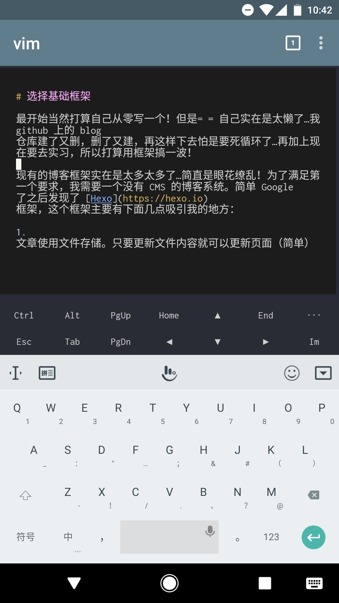

做个博客也是不断踩坑啊…从技术选型到部署，很多都是我从没接触过的东西。所以打算专门写一篇博文来说说做这个博客的时候的一些思考、遇到的坑和解决方案。

其实希望每个做 Web 开发的同学都能有自己的一个从零写起的博客（虽然我这个是以别人写好的为基础的🙄 ），在这个博客上**用上各种各样的实验性技术，不断折腾更新**！毕竟只有自己的博客才是真的想怎么搞就可以怎么搞的地方。

<blockquote class="blockquote-center"><strong>所有代码和文章都在 github 上，欢迎 dalao 们 star 😏</strong>
<a href="https://github.com/hjkcai/blog" target="_blank">https://github.com/hjkcai/blog</a></blockquote>

<!-- more -->

## 动手之前的计划

在构想这个博客的时候，我设定了几个目标：

1. 博客内容全部托管在 github 上，并且有一个单独的分支专门用来存放文章（没有或者很少代码在这个分支里面）
2. 文章可以在编辑时直接阅读（不用借助 dev-server 就可以看到文章完整效果）
3. 文章中尽量少出现必须要写代码才能完成的效果
4. push 后自动部署文章到服务器上
5. 能够方便地在不同的地方（不同的设备上）编辑文章

当然方便是最重要的！毕竟懒 🤔

## 选择基础框架

最开始当然打算自己从零写一个！但是= = 自己实在是太懒了…我 github 上的 blog 仓库建了又删，删了又建，再这样下去怕是要死循环了…再加上现在要去实习，所以打算用框架搞一波！

现有的博客框架实在是太多太多了…简直是眼花缭乱！为了满足第一个要求，我需要一个没有 CMS 的博客系统。简单 Google 了之后发现了 [Hexo](https://hexo.io) 框架，这个框架主要有下面几点吸引我的地方：

1. 文章使用文件存储。只要更新文件内容就可以更新页面（简单）
2. 文章使用 Markdown 格式（很少代码）
3. 纯前端，把生成的页面丢给 Nginx 就可以了

当然！这玩意儿的坑也是不少的…现在是时候踩坑了

## Hexo 踩坑记

### NexT 主题

hexo 的主题还是蛮多的。当然，作为一个懂一点点设计（啊呸）的人当然想自己搞一套！后来还是决定在 [NexT](http://theme-next.iissnan.com/) 主题的基础上进行少量的修改后使用。其中最大的修改就是顶栏的背景图片和博客名称了。感觉魔改完一波还是不错的233333

### 文件结构

hexo 默认的文件结构是没办法做到直接在 vscode 直接编辑预览 markdown 的，因为默认情况下，如果源文件结构是这样的：

```
_posts/
  hello-world.md
  hello-world/
    image.jpg
```

最后生成的文件的结构是：

```
article/
  hello-world/
    image.jpg
    index.html
```

问题就在于 hexo 把 markdown 文件*往里移了一层*，但文件内部的 url 不变，所以默认情况下是不可能做到直接预览的…但不能直接预览要怎么愉快地写作？？于是我想到了第一个魔改：

<blockquote class="blockquote-center"><strong>编译前把 markdown 移出来一层</strong></blockquote>

😏 具体是在 `_posts` 里，找到目录 A 下与目录同名的 A.md 文件，把 A.md 移到 A 目录的上面一层就可以了。

```javascript resolve-url.js https://github.com/hjkcai/blog/blob/hexo/scripts/resolve-url.js#L33 完整代码
glob
  .sync('./source/_posts/**/*.md')
  .filter(file => /(.*)\/\1.md$/.test(file))
  .map(file => ({ file, dest: file.replace(/(.*)\/(.*)\/\2.md$/, '$1/$2.md') }))
```

### CDN 加速

为了保证博客的加载速度，所有静态资源都是使用 CDN 进行加速的。非文章部分的静态资源可以通过改主题配置和主题源码来实现（NexT 作者已经有考虑到了这个问题）。

文章内容是动态生成的，所以必须在生成最终版本的时候就必须替换掉文章中图片引用的 URL。这个替换可以用 [hexo-cdnify](https://github.com/zqjimlove/hexo-cdnify) 来实现。

然而直接加上这个插件之后并不管用！因为文章里面的 URL 都是相对路径，原来的路径是：

```
./image.jpg
```

经过转换后是：

```
https://cdn.huajingkun.com/image.jpg
```

但是预期的 URL 应该是：

```
https://cdn.huajingkun.com/article/blog-tech-detail/image.jpg
```

调试发现 hexo 在渲染 markdown 后的 `after-render:html` filter 中没有给出任何的原始 markdown 信息！只提供了渲染后的字符串和是用的模板的路径。所以 CDN 插件才没有办法去根据 markdown 文件路径来解析 URL 而是直接生成。好了没办法了只能再来魔改一次了：

<blockquote class="blockquote-center"><strong>编译前解析所有的资源文件 URL 并把这些相对路径都改为绝对路径</strong></blockquote>

```javascript resolve-url.js https://github.com/hjkcai/blog/blob/hexo/scripts/resolve-url.js#L39 完整代码
// 将 url 解析到正确位置
function resolveUrl (url, file) {
  if (!url.includes('//') && !url.startsWith('data:')) {
    return path.resolve('/article', file.replace('./source/_posts/', ''), '..', url)
  }

  return url
}

html = html.replace(/!\[(.*)\]\((.*)\)/g, (str, alt, url) => `})`)
```

😎 这样就搞定了文章内图片资源的问题。

最后我发现页面的 meta 标签中还有一些不通过 CDN 加速的内容，所以又用了一段类似的脚本去替换这些 meta 标签里面的图片资源。这里就不贴代码了，有兴趣[点这里](https://github.com/hjkcai/blog/blob/hexo/scripts/cdnify.js#L19)。

### 调试问题

在用上了 CDN 加速之后，又有问题来了：**本地调试的时候也使用了 CDN 加速**。这样就完全没办法调试了😷 好吧再来一波魔改：

<blockquote class="blockquote-center"><strong>默认关闭所有 CDN 加速，在生成最终代码的时候再开启</strong></blockquote>

思路就是利用 `process.env.NODE_ENV` 来判断现在是处于生产环境还是开发环境，从而动态调整配置

```javascript cdnify.js https://github.com/hjkcai/blog/blob/hexo/scripts/cdnify.js#L13 完整代码
hexo.extend.filter.register('before_generate', () => {
  if (process.env.NODE_ENV === 'production') {
    hexo.config.cdn.enable = true
    hexo.theme.config.css = 'https://cdn.huajingkun.com/css'
    hexo.theme.config.js = 'https://cdn.huajingkun.com/js'
    hexo.theme.config.images = 'https://cdn.huajingkun.com/images'

    // ...
  }
}
```

### 草稿问题

完成了上面的内容以后，我还发现，按照当前的项目结构是没有办法储存草稿的！！也就是说如果有写了一半的文章，一旦 push 就是发布。虽然 hexo 自带草稿系统，但是草稿是存在 `_drafts` 文件夹而不是 `_posts` 文件夹下，这就很尴尬了。

于是我在想，每篇文章前面都会有一个 "front-matter" 区域，如果在这里面定义一个 `draft: true` 的字段，编译的时候如果遇到含有 `draft: true` 的文章就直接跳过。但不可能直接通过字符串匹配的方式来做，因为万一文章里面就有这行代码怎么办？

经过大量的调试，我发现 **hexo 在编译时会内建一个数据库来储存要生成的文章**，而且在这个数据库中储存了所有在 front-matter 中定义的字段。这样就很简单了，把符合条件的文章从数据库里面删掉就行！

```javascript drafts-killer.js https://github.com/hjkcai/blog/blob/hexo/scripts/drafts-killer.js 完整代码
if (process.env.NODE_ENV === 'production') {
  hexo.extend.filter.register('before_generate', () => {
    return hexo.database._models.Post.remove({ draft: true })
  })
}
```

## 后记

做完整个博客之后有种感觉…所有的坑都是我期望的文件结构导致的🌚 但不管怎么样最后还是成功实现了哈哈！现在上课用手机 vim 打文章，可开心了呢！



另外在手机上有什么编辑器好用…毕竟我只是个 vim 渣渣😂
